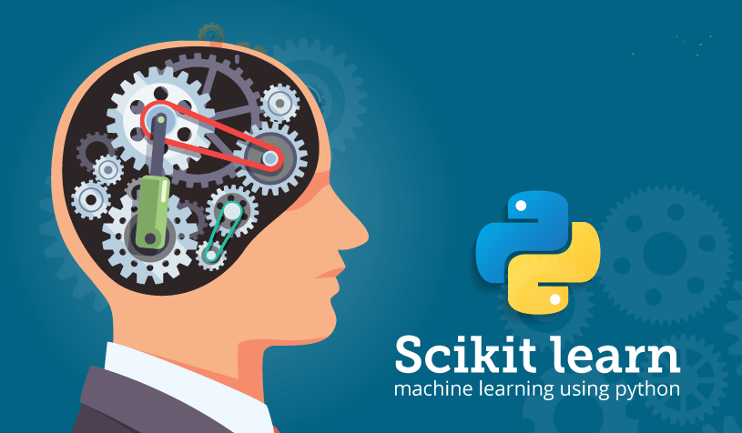

# machine learning with scikit-learn
This Repo contains most of common uses of sci-kit learn 
> note : these notebooks can be used a self reference 

Dependencies
~~~~~~~~~~~~

scikit-learn requires:

- Python (>= 3.5)
- NumPy (>= 1.11.0)
- SciPy (>= 0.17.0)
- joblib (>= 0.11)

~~~~~~~~~~~~~~~~~
User installation

If you already have a working installation of numpy and scipy,
the easiest way to install scikit-learn is using ``pip`` ::

    pip install -U scikit-learn

or ``conda``::

    conda install scikit-learn

The documentation includes more detailed `installation instructions <http://scikit-learn.org/stable/install.html>`_.

## Content

### [1 Preprocessing ](https://github.com/mahmoudmuawad/scikit-learn_Common_Practice/tree/master/Preprocessing)

### [2 Regression ](https://github.com/mahmoudmuawad/scikit-learn_Common_Practice/tree/master/Regression)
* Linear Regression
* Regularization
* Random Forest Regression
* SVR
* Decision Tree Regression

### [3 Classification ](https://github.com/mahmoudmuawad/scikit-learn_Common_Practice/tree/master/Classification)
* Logistic Regression
* Decision Tree
* SVM
* SVR
* KNN
* Naive Bayes
* Kernel SVM
* Random Forest

### [4 Clustring ](https://github.com/mahmoudmuawad/scikit-learn_Common_Practice/tree/master/clustering)
* HC-Clustring
* Kmeans-Clustring
  
